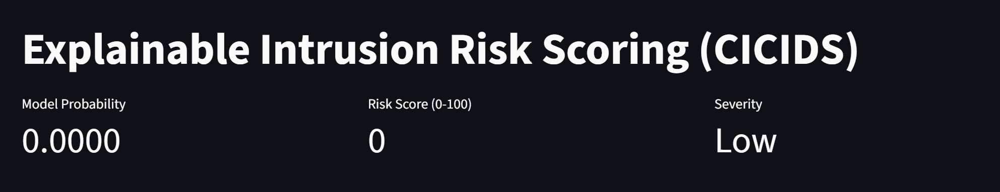
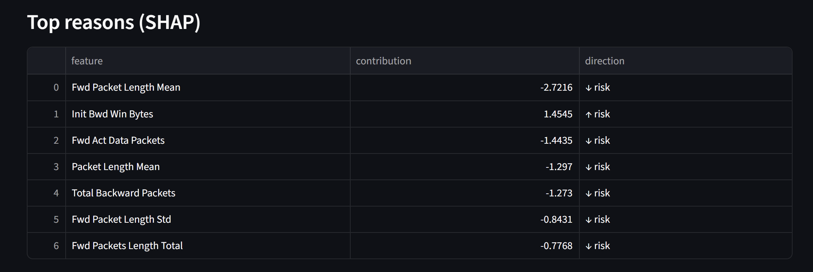

# 🔐 Explainable Intrusion Risk Scoring System (CICIDS)


[](https://github.com/aardranpk)


An **end-to-end, explainable AI system** for network intrusion detection that goes beyond binary alerts by producing **risk scores, severity levels, and human-interpretable explanations** for security analysts.

This project demonstrates how machine learning can support **real-world SOC (Security Operations Center) decision-making**, not just model accuracy.

---

## 🚨 Problem Statement

Traditional intrusion detection systems often generate **binary alerts** (attack / no attack), which leads to:

- Alert fatigue for security analysts  
- Poor prioritization of threats  
- Lack of transparency in ML-driven decisions  

In real security operations, analysts need answers to:
- *How risky is this event?*
- *Why was it flagged?*
- *What should I investigate first?*

---

## 🎯 Solution Overview

This project implements an **Explainable Intrusion Risk Scoring System** that:

- Detects malicious network traffic using **XGBoost**
- Outputs a **risk score (0–100)** instead of a binary label
- Assigns **severity levels** (Low / Medium / High / Critical)
- Explains predictions using **SHAP feature attributions**
- Provides an **interactive Streamlit dashboard** for analysts

---

## 🧠 Key Features

- Risk-based scoring rather than yes/no predictions  
- Explainable AI (XAI) using SHAP for transparency  
- Imbalance-aware modeling for realistic attack detection  
- Analyst-friendly dashboard for exploration and triage  
- Production-style project structure (no notebooks required)

---

## 🏗️ Architecture

The system follows a production-style ML pipeline designed for SOC workflows:

Network Flow Data (CICIDS)
<br>│
<br>▼
<br>Data Loader & Preprocessing
<br>│
<br>▼
<br>XGBoost Classifier
<br>│
<br>├── Probability (0–1)
<br>│
<br>├── Risk Score (0–100)
<br>│ └── Severity Mapping
<br>│
<br>└── SHAP Explainer
<br>│
<br>▼
<br>Analyst Dashboard (Streamlit)


---

## 📊 Dataset

- **CICIDS 2017** (Canadian Institute for Cybersecurity)
- Network flow-level features
- Includes benign traffic and multiple attack scenarios  
- Dataset files are **not committed** (handled via `.gitignore`)

---

## 🛠️ Tech Stack

- Python 3
- Pandas, NumPy
- Scikit-learn
- XGBoost
- SHAP
- Streamlit
- Joblib
- FastAPI
- pytest

---

## ⚙️ Installation & Setup

### 1️⃣ Clone the repository
```bash
git clone https://github.com/aardranpk/intrusion-risk-scoring-ai.git
cd intrusion-risk-scoring-ai

```
### 2️⃣Create & activate virtual environment
```bash
python -m venv .venv
.\.venv\Scripts\Activate.ps1

```
### 3️⃣ Install dependencies
```bash
pip install -r requirements.txt

```
## 📁 Data Setup

Create a data/ folder in the project root and place one CICIDS parquet file inside:

data/
 └── Portscan-Friday-no-metadata.parquet
Dataset files are excluded from version control.

## 🚀 Running the Project

#### Train baseline model
```bash
python -m src.models.train_baseline

```

#### Train XGBoost risk scoring model
```bash
python -m src.models.train_xgb

```

#### Run risk scoring demo
```bash
python -m src.models.demo_risk_score

```

#### Run SHAP explanation demo
```bash
python -m src.explain.demo_explain


```

#### Launch dashboard
```bash
python -m streamlit run dashboard/app.py

```
## 🌐 REST API (FastAPI)

Start the API:
```bash
uvicorn src.app.main:app --reload
```
Interactive docs at http://127.0.0.1:8000/docs

| Method | Endpoint   | Description |
|--------|------------|-------------|
| GET    | `/health`  | Service status and whether a trained model is loaded |
| POST   | `/score`   | Convert a probability (0–1) into a risk score and severity |
| POST   | `/predict` | Score one network flow with the trained XGBoost model |

Example:
```bash
curl -X POST http://127.0.0.1:8000/score -H "Content-Type: application/json" -d '{"probability": 0.82}'
# {"risk_score":82,"severity":"High","model_probability":0.82}
```

## ✅ Testing

```bash
pytest
```
24 tests cover risk-score conversion, severity band boundaries, input validation, and all API endpoints.
API tests use a fake model, so they run without the dataset or a trained model.
Tests run automatically on every push and pull request via GitHub Actions.


## 📈 Example Results

- ROC-AUC ≈ **0.999**
- High recall for attack traffic
- Risk score + severity per network flow
- Top contributing features for every prediction

---

## 🔍 Explainability Example (SHAP)

Fwd Packet Length Mean → ↓ risk
<br>Init Bwd Win Bytes → ↑ risk
<br>Total Backward Packets → ↓ risk


This allows analysts to **understand and trust** model decisions.

---
## 🖥️ Dashboard Preview

### Risk Scoring Overview


### Explainability (SHAP)



## ⚠️ Limitations

- Single dataset source (CICIDS)
- No real-time streaming ingestion
- No analyst feedback loop

---

## 🔮 Future Improvements

- Multi-class attack classification
- Real-time log ingestion (streaming)
- Analyst feedback loop for retraining
- Model drift detection
- Authentication & RBAC for dashboard

---

## 💼 Resume Highlight

> Built an explainable AI-based intrusion risk scoring system using XGBoost and SHAP, enabling risk-based prioritization of network traffic with transparent, analyst-facing explanations.

---

## 📌 Why This Project Matters

This project focuses on **how AI is used in security operations**, not just model accuracy.  
It demonstrates:

- Systems thinking
- Explainable ML
- Practical security trade-offs
- Production-ready engineering practices

---

## 👤 Author

**Aardran Premakumar**  
AI / ML | Security Analytics
